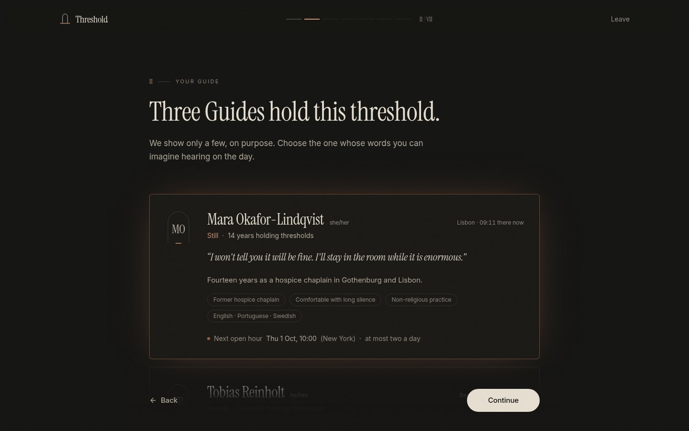
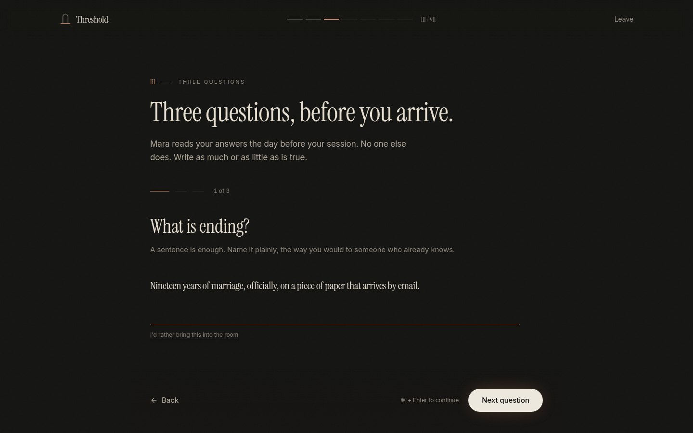
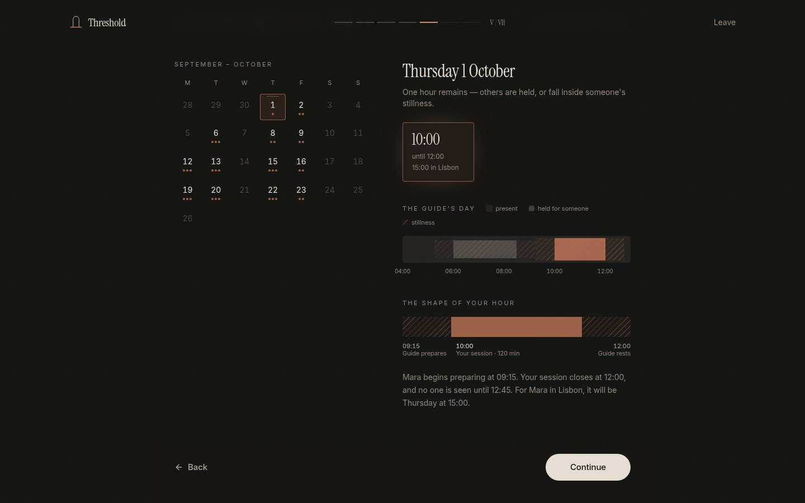
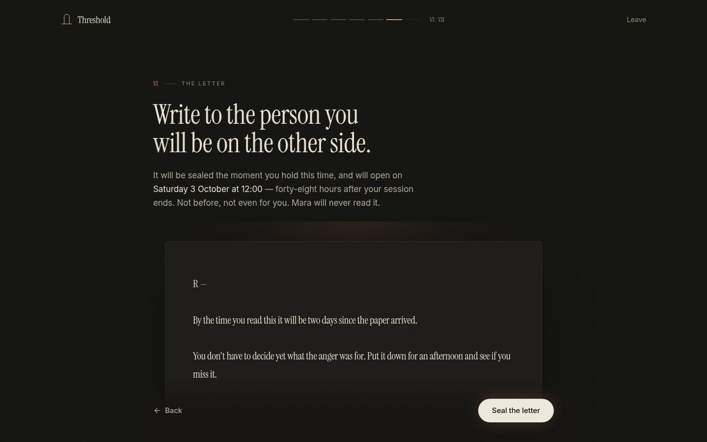
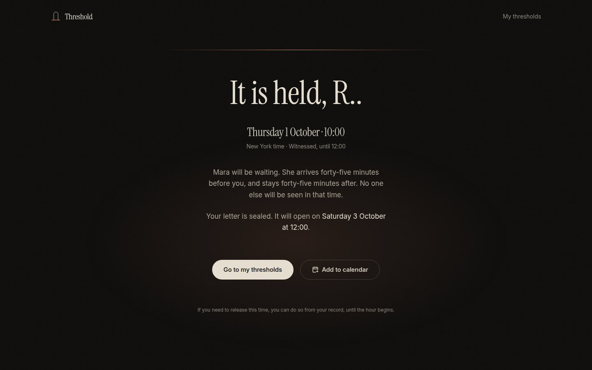
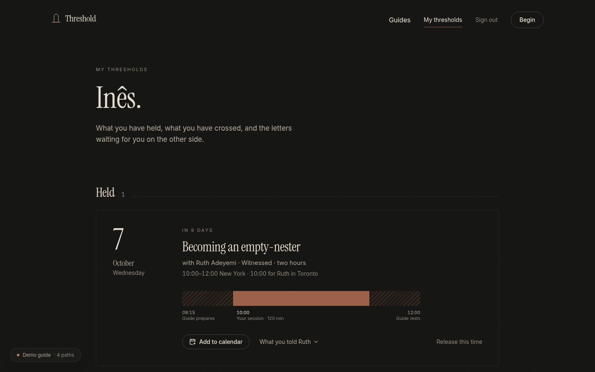
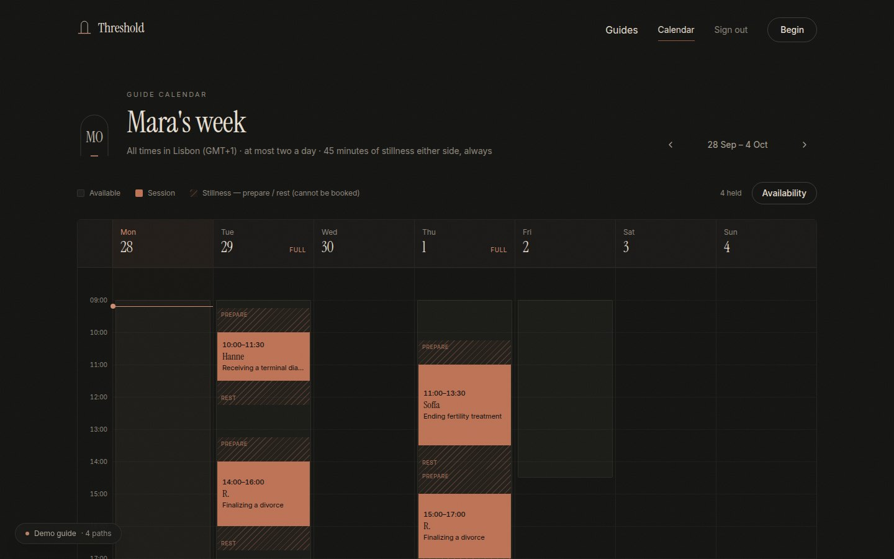
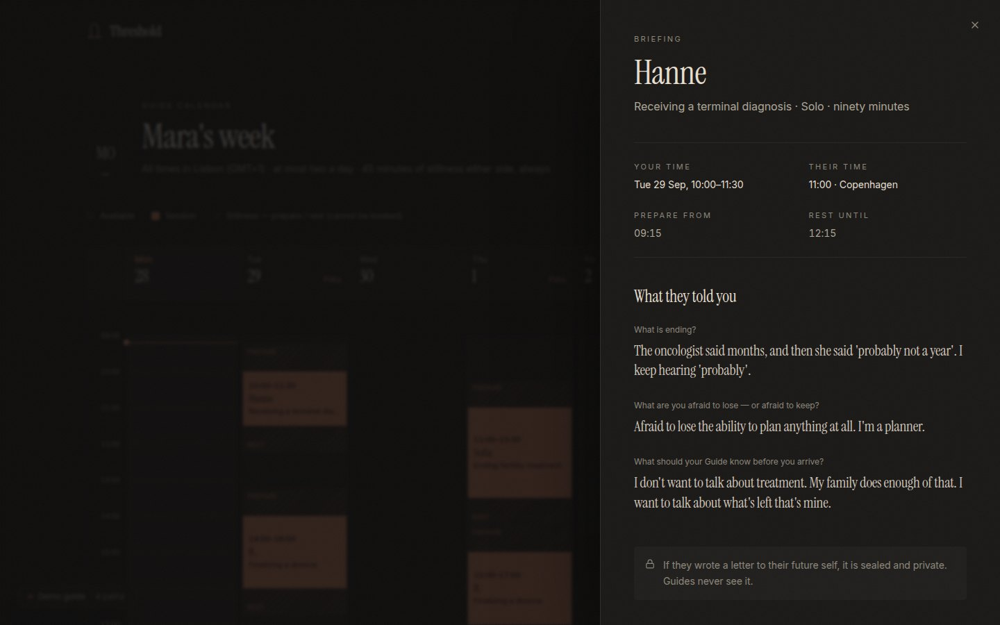

# Threshold

**An appointment platform for irreversible life thresholds** — the quiet, high‑stakes moments when a person's identity, body, status or future permanently changes. Facilitators are called **Threshold Guides**. This is not therapy.

> Some doors only close behind you.

Built with Lovable's stack: **React + Vite + TypeScript + Tailwind + shadcn/ui + Supabase**.


<table>
  <tr>
    <td></td>
    <td></td>
  </tr>
  <tr>
    <td></td>
    <td></td>
  </tr>
  <tr>
    <td></td>
    <td></td>
  </tr>
  <tr>
    <td></td>
    <td></td>
  </tr>
</table>

---

## Run it

```bash
npm install
npm run dev          # http://localhost:8080
```

With no Supabase credentials, Threshold runs a **self-contained seeded demo**. It uses the same rules as the database and stores its data in the browser, so it can be demoed straight away.

| Demo account | Email | Password | What you'll see |
|---|---|---|---|
| Client | `ines@threshold.demo` | `threshold` | One threshold crossed, one held, one letter unsealed, one sealed |
| Guide | `mara@threshold.demo` | `threshold` | Her week, buffers, and each client's briefing |

Both are also one-tap buttons on `/login`. In demo mode a small **Demo guide** panel (bottom-left) offers the four paths worth seeing — the ritual, a client's record, an unsealed letter, a Guide's week — plus a reset. It stays out of the ritual and the letter view.

### A 60‑second demo path

1. **`/`** — the concept in under ten seconds: a headline, a doorway and a cycling list of real thresholds.
2. **Begin** → pick a threshold → meet **3–5 Guides** (never more) → three reflective questions → pick a form → choose an hour → write a letter → **Hold this time**.
3. The cinematic confirmation → **My thresholds** (the held session, and the sealed letter with its countdown).
4. **Sign in as Inês** → open her unsealed letter.
5. **Sign in as Mara** → the Guide calendar, with hatched 45‑minute buffers either side of every session. Click a session to read its briefing.

---

## The Booking Ritual

| | Step | What's encoded |
|---|---|---|
| I | The threshold | Choose one of nine, or describe it in your own words. Keyword soft‑matching suggests the nearest. |
| II | Your Guide | Soft matching returns **3–5 Guides**. Each card shows the Guide's local time and their next open hour in *your* timezone. |
| III | Three questions | Asked one at a time. Each can be skipped ("I'd rather bring this into the room"). The Guide reads the answers as a briefing. |
| IV | The form | Solo (90) · Witnessed (120) · Threshold + Practical Aftermath (150). Drawn to scale, buffers included. |
| V | The hour | Real availability, **hard 45‑minute buffers before and after**, a daily limit, 24 h minimum notice, and correct handling of timezones and clock changes. Shows the Guide's day to scale. |
| VI | The letter | Sealed until **48 hours after the session ends**. Guides can never read it. |
| VII | Hold | Review, name, and an inline account. Guests can go through the whole ritual; they only need an account to hold the time. |
| — | Confirmation | Not a checkmark: the screen dims, a line of light draws, the words arrive one at a time. Exports an `.ics` file. |

The draft is kept on the device (it survives a reload or an email confirmation) and cleared once the time is held.

**Edge cases handled on the core path:** a slot taken by someone else mid‑ritual (you return to *The hour* with an explanation and nothing you wrote is lost), a Guide's daily limit, a slot drifting under 24 h notice, double‑booking yourself, a changed timezone, clock changes (DST), cancellation (optimistic, with the letter returned unopened), network errors, private mode (in‑memory fallback), and email‑confirmation sign‑ups.

---

## Data model (Supabase)

`supabase/migrations/20260928000000_threshold_core.sql`

| Table | Purpose |
|---|---|
| `profiles` | Mirrors `auth.users` (display name, timezone, role). Users can't change their own role. |
| `thresholds` | The nine moments, with matching keywords. |
| `session_types` | Forms and their durations (duration lives in data, not the client). |
| `guides` · `guide_thresholds` | Guides, presence type, tags, timezone, `max_sessions_per_day`, `buffer_min ≥ 45`. |
| `availability_rules` | Weekly windows in the Guide's **local** time. |
| `sessions` | Type, status, buffers and a `blocked_range tstzrange`, protected by an **exclusion constraint**: no two held spans (buffers included) of one Guide can overlap. |
| `reflective_answers` | The three answers (null = "bring it into the room"). |
| `future_self_letters` | Time‑locked letters. |

**Row-level security**
- Guests (`anon`) can read the catalogue (thresholds, forms, Guides and availability), so the ritual can start without an account.
- `guide_busy_ranges()` gives guests busy times with nothing else attached: no names and no details.
- Sessions and answers are visible only to the client and their Guide.
- Letters are readable **only by their author, and only once `unlocks_at <= now()`**. No policy lets a Guide read them. `my_letters()` returns sealed envelopes without the body.
- Nobody can insert or update sessions directly. All writes go through `book_session()` and `cancel_session()`.

**`book_session()`** is atomic and locks the Guide row. It checks auth, notice, the 15‑minute grid, that the whole span *including buffers* fits one availability window in the Guide's timezone, clashes, the daily limit and client overlap. The exclusion constraint backs it up if two bookings race. It returns stable error codes (`slot_taken`, `day_full`, `too_soon`, …) that the UI turns into plain language.

### Run against Supabase locally (Docker)

```bash
npx supabase start          # applies supabase/migrations + supabase/seed.sql
# copy the printed API URL + anon key into .env.local:
#   VITE_SUPABASE_URL=http://127.0.0.1:54321
#   VITE_SUPABASE_PUBLISHABLE_KEY=<anon key>
npm run dev
```

The whole ritual — GoTrue sign-up, `book_session`, sealed letters, a slot taken by a second real user mid-ritual, cancellation, the Guide calendar — has been walked end-to-end in a browser against this stack. supabase-js is code-split: it loads only when a backend is configured, and the demo build never ships it.

### Connect a hosted Supabase project

1. Run `supabase/migrations/*.sql`, then `supabase/seed.sql`, in the SQL editor (or `supabase db reset` locally). Lovable's Supabase integration also accepts these migrations.
2. Copy `.env.example` to `.env` and set `VITE_SUPABASE_URL` and `VITE_SUPABASE_PUBLISHABLE_KEY`.
3. Optional: turn off email confirmation for smoother demos. If it stays on, the ritual shows "check your email" and keeps the draft.

The seed places every session relative to `now()` on real open days, so the product feels alive whenever it's seeded.

---

## Tests

```bash
npm test          # slot engine, DST, cross‑timezone grouping, demo store parity, matching
npm run test:db   # schema + RLS + booking RPC against Postgres (needs PGHOST/PGPORT/PGUSER)
npm run e2e       # Playwright: the ritual, a mid-ritual clash, release, Guide briefing — desktop + mobile
```

CI (`.github/workflows/ci.yml`) runs all three on every push, and checks that `supabase/seed.sql` is in sync with its TypeScript source.

`supabase/tests/booking_rls.sql` runs 40+ assertions against plain Postgres using a small Supabase auth stub. For example: guests can't see sessions, a Guide can never read a letter, a sealed letter comes back without its body, a slot 75 min after a session is refused but one 90 min after is accepted, and a clash raises `slot_taken` even on direct table writes.

`src/lib/data/seed.ts` is the single source of truth for demo data. After changing it, run `npm run seed:sql` to regenerate `supabase/seed.sql`.

---

## Design system

- **Palette:** deep charcoal ground, warm bone text, one oxidized-copper accent. There's no pure white and no blue, and dark is the default.
- **Type:** *Instrument Serif* (slightly condensed) for headings and letters, *Inter* for UI.
- **Motion:** fades, gentle height changes and a line of light, and nothing else. `prefers-reduced-motion` is respected.
- **Visual grammar:** buffers are always drawn with the same copper hatch ("stillness"), so the rule reads the same everywhere: landing page, forms, calendar, record and Guide week.
- **Accessibility:** native radio groups for every choice, an arrow-key date picker, focus moves to each step's heading, a skip link, `aria-live` notices, and `prefers-reduced-motion` honoured everywhere (steps swap instantly, nothing waits on an animation). axe-core reports **zero WCAG 2.1 AA violations across every route and every ritual step, desktop and mobile**, and `e2e/a11y.spec.ts` keeps it that way in CI. Even the quietest text tier is tuned to pass AA on every surface.

---

Every person in the demo data is fictional. Threshold is not a crisis service. If you are in danger, contact your local emergency number or visit [findahelpline.com](https://findahelpline.com).

*Built with [Lovable](https://lovable.dev).*
